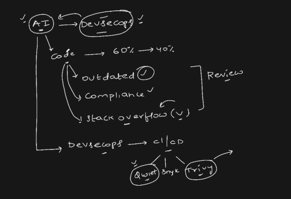
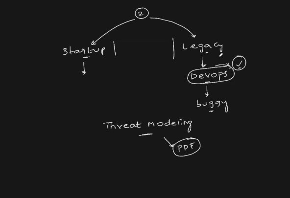

# ShifLeft Principle

- L---------------------R
- L -> where the application developement starts.
- R -> where the application is deployed to production.
- Earlier, when the application is deployment then, we used to think of the security of the application. -> ShildRight Approach

- ShiftLeft says that we should think about the security from the very early stage.

## Shift Left Principle (in DevSecOps)

**Shift Left** means **moving security practices earlier (“to the left”) in the software development lifecycle**—starting from the planning and coding stages instead of waiting until testing or deployment.

---

## Simple Definition

Shift Left = **Fix security issues early rather than late**

---

## Why “Left”?

If you imagine the SDLC as a timeline:

Planning → Development → Testing → Deployment → Production

“Left” refers to the **earlier stages** (planning and development).

---

## Traditional vs Shift Left

### Traditional Approach

* Security testing happens during or after testing
* Bugs are found late
* Fixing them is expensive and time-consuming

### Shift Left Approach

* Security is applied during coding and design
* Bugs are caught early
* Fixing them is faster and cheaper

---

## How Shift Left Works in Practice

### 1. During Planning

* Define security requirements
* Threat modeling

### 2. During Development

* Developers follow secure coding practices
* Use static code analysis tools

### 3. During Build

* Scan dependencies for vulnerabilities

### 4. During CI/CD

* Automate security checks using tools like Jenkins or GitHub Actions

---

## Example

Suppose you are building a backend API:

* Without Shift Left:
  SQL injection vulnerability is found after deployment

* With Shift Left:
  Static analysis tool detects the issue while coding
  Developer fixes it immediately

Result: Less risk, less cost, faster delivery

---

## Benefits

* Early bug detection
* Lower cost of fixing issues
* Faster development cycles
* Improved application security
* Better collaboration between teams

---

## Interview One-Liner

Shift Left is the practice of integrating security and testing early in the development lifecycle to detect and fix issues as soon as possible.

