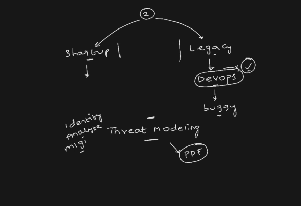

## Threat Modeling (in DevSecOps)

**Threat modeling** is the process of **identifying, analyzing, and mitigating security threats** to an application **before it is built or deployed**.

---

## Simple Definition

Threat modeling = **Think like an attacker before building the system**

---

## Why It’s Important

* Helps detect vulnerabilities **early**
* Reduces cost of fixing issues later
* Improves overall system security
* Supports the **Shift Left** principle in DevSecOps

---

## Key Steps in Threat Modeling

### 1. Identify Assets

* What needs protection?
  Example: user data, APIs, database, credentials

---

### 2. Create Architecture Diagram

* Understand how the system works
* Components: frontend, backend, database, external APIs

---

### 3. Identify Threats

* Think of possible attacks on each component

Common threats:

* SQL Injection
* Cross-Site Scripting (XSS)
* Authentication bypass
* Data leakage

---

### 4. Analyze Risks

* How serious is the threat?
* Likelihood + impact

---

### 5. Mitigate Threats

* Apply security controls

  * Input validation
  * Encryption
  * Authentication & authorization

---

## Popular Threat Modeling Framework

### STRIDE Model (by Microsoft)

* **S** – Spoofing (fake identity)
* **T** – Tampering (data modification)
* **R** – Repudiation (denying actions)
* **I** – Information Disclosure (data leaks)
* **D** – Denial of Service (system overload)
* **E** – Elevation of Privilege (unauthorized access)

---

## Example (Real Scenario)

You are building a login system:

* Threat: attacker tries brute-force login
* Risk: unauthorized access
* Mitigation:

  * Rate limiting
  * CAPTCHA
  * Multi-factor authentication

---

## Tools for Threat Modeling

* Microsoft Threat Modeling Tool
* OWASP Threat Dragon
* Lucidchart (for diagrams)

---

## Benefits

* Finds security issues before development
* Improves design decisions
* Saves time and cost
* Builds secure-by-design systems

---

## Interview One-Liner

Threat modeling is the process of identifying potential security threats in a system and designing countermeasures early in the development lifecycle.

