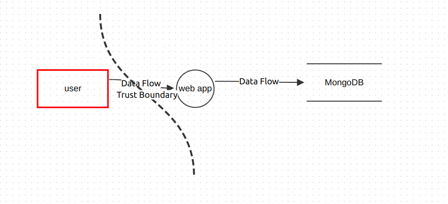
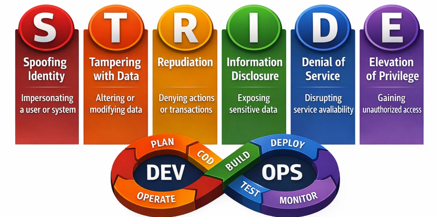

# OWASP Threat Dragon

## OWASP Threat Dragon


**OWASP Threat Dragon** is an open-source threat modeling tool developed by the OWASP.
It helps developers **design secure systems by identifying threats visually using diagrams**.

---

## Simple Definition

OWASP Threat Dragon = **Tool to create system diagrams and identify security threats (using STRIDE)**

---

## Key Features

1. **Data Flow Diagrams (DFD)**

   * Visualize how data moves in your system
   * Components: processes, data stores, external entities

2. **STRIDE-Based Threat Detection**

   * Automatically suggests threats using STRIDE model

3. **Open Source**

   * Free to use and customizable

4. **Web + Desktop Versions**

   * Can run locally or in browser

5. **Easy Integration**

   * Useful in DevSecOps pipelines and design phase

---

## How It Works (Step-by-Step)

### 1. Create a Diagram

* Add components like:

  * User (external entity)
  * Backend server (process)
  * Database (data store)

---

### 2. Define Data Flows

* Show how data moves between components

---

### 3. Identify Threats

* Tool suggests threats based on STRIDE:

  * Spoofing
  * Tampering
  * Information disclosure, etc.

---

### 4. Add Mitigations

* Define how to fix each threat

  * Encryption
  * Authentication
  * Input validation

---

## Example

For a login system:

* User → API → Database

Threats identified:

* Spoofing (fake login attempts)
* SQL Injection (tampering with queries)

Mitigations:

* JWT authentication
* Prepared statements

---

## Why Use OWASP Threat Dragon

* Helps apply **Shift Left security**
* Easy for beginners to understand threat modeling
* Visual approach improves system design clarity
* Widely used in DevSecOps workflows

---

## Interview One-Liner

OWASP Threat Dragon is an open-source threat modeling tool that helps developers create data flow diagrams and identify security threats using the STRIDE methodology.


You’re on the **download page of OWASP Threat Dragon**, and it shows different installation files for different platforms.

Since you're using **Ubuntu (Linux)**, here’s exactly what you should pick and how to install:

---

## ✅ Best Option for Ubuntu

### 🔹 Choose:

**Linux AppImage → `Threat-Dragon-2.5.0.AppImage`**

👉 This is the easiest method (no installation required)

---

## 🚀 Steps to Run (AppImage)

1. Download the file:

```
Threat-Dragon-2.5.0.AppImage
```

2. Open terminal in the download folder

3. Make it executable:

```bash
chmod +x Threat-Dragon-2.5.0.AppImage
```

4. Run it:

```bash
./Threat-Dragon-2.5.0.AppImage
```

That’s it — the app will launch.

---

## 🧠 Alternative (If you prefer package install)

### 🔹 Debian Package (`.deb`)

Choose:

```
threat-dragon_2.5.0_amd64.deb
```

Then install:

```bash
sudo dpkg -i threat-dragon_2.5.0_amd64.deb
sudo apt-get install -f   # fix dependencies if needed
```

---

## ⚡ Which Should You Use?

* **AppImage** → simplest, no setup (recommended)
* **.deb** → better if you want proper system install
* **Docker** → best for DevOps workflows

---

## 💡 Pro Tip (for your career)

Since you're targeting **DevOps/SRE roles**, learn this combo:

* Run Threat Dragon via **Docker**
* Use it in **CI/CD pipeline security design**

---

# Using Docker

```
docker pull owasp/threat-dragon:v2.6.0


```



